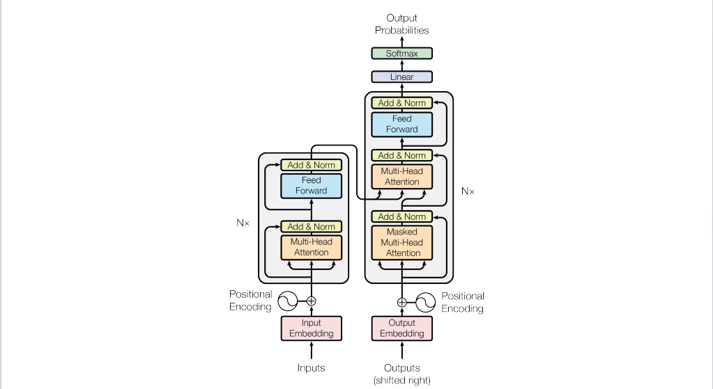
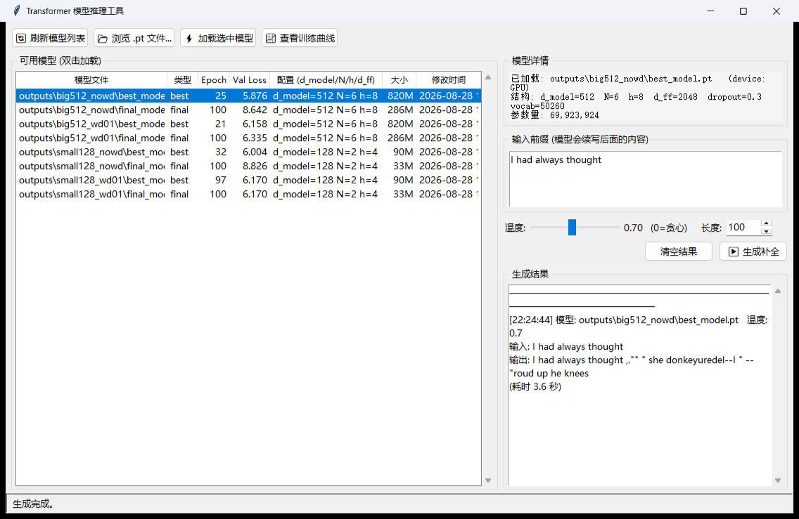
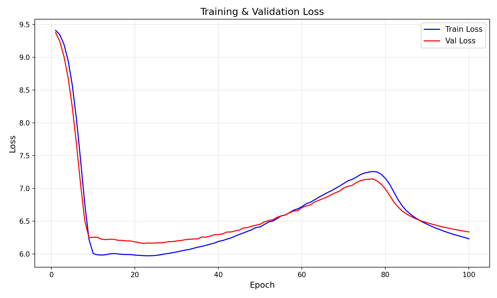
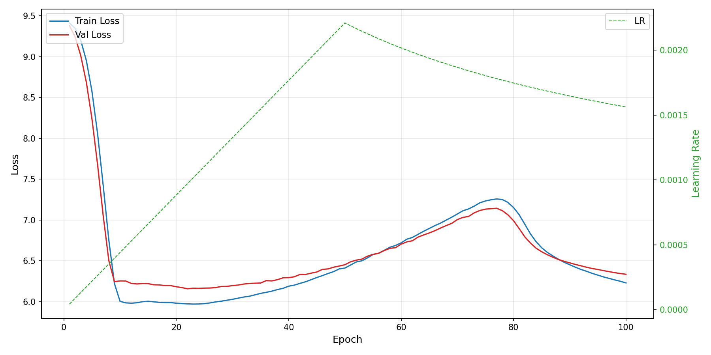
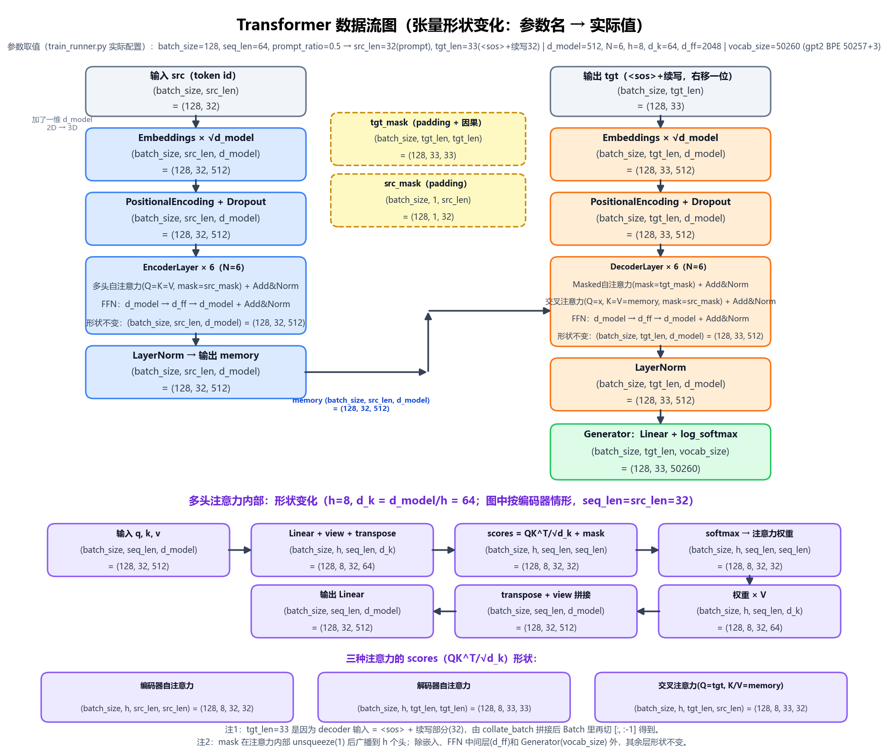

<p align="center">
  
</p>

# Annotated Transformer 中文实践：从逐行实现到句子补全 + 推理工具箱

基于哈佛 NLP 的 **The Annotated Transformer**（[Attention Is All You Need](https://arxiv.org/abs/1706.03762) 逐行注释版），本项目做了三件事：

1. **从零实现完整 Transformer**（编码器-解码器、多头注意力、位置编码、标签平滑、Noam 学习率调度），代码与论文 Figure 1 逐块对应，附中文注释；
2. 把模型应用到**英文句子补全（续写）任务**：输入前缀，自回归生成后续文本，支持 BPE 分词、温度采样；
3. 在不改核心代码的前提下封装出**一行式训练 API** 和**零依赖桌面推理界面**，训练实验只需 `train(参数=值, ...)`。

> 本仓库以原版 [harvardnlp/annotated-transformer](https://github.com/harvardnlp/annotated-transformer)（MIT License）为基础，`src/transformer_model.py` 等核心实现及本页介绍的训练/推理工具均为中文注释的实践版本。

---

## 运行效果预览

**推理界面**（Tkinter，零额外依赖）：自动扫描所有训练产出的模型 → 双击加载（显示参数量 / 训练进度 / 验证 loss / GPU 或 CPU）→ 输入前缀一键续写，保留生成历史：



**训练可视化**：每次训练自动保存 loss 曲线、学习率曲线和双轴合并图到输出目录：

| 训练 / 验证损失曲线 | Loss + 学习率合并视图 |
|---|---|
|  |  |

**模型管理**（`python src/transformer_api.py list`，扫描全部 `outputs/` 并读取 checkpoint 元信息）：

```text
模型文件                             类型   Epoch  ValLoss 配置                                 大小    修改时间
--------------------------------------------------------------------------------------------------------------
outputs\big512_nowd\best_model.pt    best     25    5.876 d_model=512 N=6 h=8 d_ff=2048    820.0M  2026-08-28 14:00
outputs\big512_nowd\final_model.pt   final   100    8.642 d_model=512 N=6 h=8 d_ff=2048    286.4M  2026-08-28 14:00
outputs\big512_wd01\best_model.pt    best     21    6.158 d_model=512 N=6 h=8 d_ff=2048    820.0M  2026-08-28 14:03
outputs\small128_nowd\best_model.pt  best     32    6.004 d_model=128 N=2 h=4 d_ff=512      89.8M  2026-08-28 14:13
outputs\small128_wd01\best_model.pt  best     97    6.170 d_model=128 N=2 h=4 d_ff=512      89.8M  2026-08-28 14:00
...
```

**一行推理**（`python src/transformer_api.py infer "I had always thought"`，不指定 `--model` 时自动选 val_loss 最低的 best 模型）：

```text
[transformer_api] 已加载 outputs\big512_nowd\best_model.pt (epoch=25, 参数量=69,923,924, device=cuda)
输入: I had always thought
补全: I had always thought ed by one No, the had " must. "Heroud the and reason."
```

> 以上均为真实运行记录。示例模型仅在约 2 万字符的小语料上训练了少量轮次，补全质量尚在「能看出学习趋势」的阶段——这正是本项目适合练手的地方：换 `data/combined.txt`、调大 `num_epochs`，看着曲线一点点变好。

---

## 目录

- [运行效果预览](#运行效果预览)
- [实验环境](#实验环境)
- [快速开始](#快速开始)
- [文件结构总览](#文件结构总览)
- [使用指南](#使用指南)
  - [训练（一行式 API）](#1-训练一行式-api推荐)
  - [查看已有模型](#2-查看已有模型)
  - [推理](#3-推理)
  - [推理界面](#4-推理界面)
  - [早期入口与辅助脚本](#5-早期入口与辅助脚本)
- [训练输出说明](#训练输出说明)
- [学习笔记与论文原版](#学习笔记与论文原版)
- [任务与数据流](#任务与数据流)
- [已知问题与规避](#已知问题与规避)
- [License](#license)

---

## 实验环境

| 项目 | 配置 |
|---|---|
| GPU | NVIDIA GeForce RTX 3060 Laptop GPU（CUDA 加速，纯 CPU 也可运行） |
| 操作系统 | Windows 10 / 11 |
| Python | 3.9 |
| 深度学习框架 | PyTorch 1.11.0+cu113 |
| 分词器 | tiktoken（gpt2 BPE，50257 词表 + `<pad>/<sos>/<eos>` 3 个特殊 token） |
| 可视化 | matplotlib（Agg 后端，自动保存训练曲线） |
| 推理界面 | Tkinter（Python 标准库，**无需额外安装**） |

全部依赖已固化在 [`requirements.txt`](requirements.txt)，版本与实际验证过的环境一致，分三段：

- **核心依赖（必需）**：`torch==1.11.0+cu113`、`tiktoken==0.9.0`、`matplotlib==3.9.2`、`numpy==1.26.4`——训练 / 推理全部所需；
- **原版论文构建（可选）**：torchtext / spacy / altair / jupytext 等，仅复现原版 notebook 与博客页时安装；
- **开发工具（可选）**：flake8 / black（对应 CI 检查与 `make flake` / `make black`）。

推理界面基于 Python 标准库 tkinter，无需额外安装。

## 快速开始

```bash
# 1. 创建并激活环境 (Python 3.9; torch 1.11.0+cu113 的官方轮子最高支持 3.10)
conda create -n annotated-transformer python=3.9 -y
conda activate annotated-transformer

# 2. 安装依赖
pip install -r requirements.txt      # GPU 版 (CUDA 11.3)
# 纯 CPU 机器: 把 requirements.txt 里的 torch==1.11.0+cu113 改为 torch==1.11.0

# 3. 冒烟测试: 最小模型跑 2 个 epoch, 验证训练/存档/绘图整条链路 (~2 分钟)
python src/demo_train.py

# 4. 启动推理界面, 加载模型即可续写
launch_gui.bat   # 双击即可; 或命令行: python src/model_gui.py
```

---

## 文件结构总览

```
annotated-transformer/
├── README.md                     # 本文件
├── LICENSE                       # MIT License
├── requirements.txt              # 依赖清单（核心必需 / 原版论文可选 / 开发工具）
├── launch_gui.bat                # 双击启动推理界面（自动定位 conda 环境）
│
├── src/                          # ★全部项目代码（互相 import，保持同目录）
│   ├── transformer_model.py      #   模型架构（EncoderDecoder/注意力/FFN/make_model）
│   ├── train_utils.py            #   训练组件（Batch/标签平滑/LR调度/数据集/贪心解码）
│   ├── train_runner.py           #   完整训练/推理流程（底层 train()/infer()）
│   ├── plot_utils.py             #   训练曲线绘制（loss / lr / 合并图）
│   ├── transformer_api.py        #   一站式封装：train()/list_models()/infer() + CLI
│   ├── model_gui.py              #   Tkinter 推理界面
│   ├── demo_train.py             #   最小训练示例（冒烟测试）
│   └── train_sentence_completion.py  # 早期命令行入口（argparse，保留兼容）
│
├── tools/                        # 独立小脚本（无项目内依赖）
│   ├── check_data.py             #   语料检查：段落数/数据划分/多小说占比统计
│   ├── draw_dataflow.py          #   生成张量形状数据流图（输出到 docs/）
│   └── text.py                   #   CUDA 可用性小测试
│
├── data/                         # 训练语料
│   ├── the-verdict.txt           #   默认语料（英文短篇，约 2 万字符）
│   └── combined.txt              #   多部英文小说合并语料（约 80 万字符）
│
├── outputs/                      # ★所有训练产物（子目录名任意, 按配置命名便于区分）
│   └── */                        #   如 big512_nowd / small128_wd01 / output_N（默认自动递增）
│       ├── best_model.pt         #   按验证 loss 保存的最佳模型（含 config/epoch/loss）
│       ├── final_model.pt        #   最终模型
│       ├── train.log             #   完整训练日志
│       ├── loss_curve.png        #   训练/验证损失曲线
│       ├── lr_curve.png          #   学习率曲线
│       └── loss_lr_combined.png  #   Loss+LR 双轴合并图
│
├── docs/                         # 文档与图
│   ├── index.html + css          #   原版博客网页
│   ├── transformer_dataflow.md   #   张量形状数据流图文说明（含易错点提醒）
│   ├── transformer_dataflow.png  #   数据流图（tools/draw_dataflow.py 生成）
│   └── transformer.png           #   模型架构图截图
│
├── screenshots/                  # 本 README 使用的运行效果截图
├── images/                       # 原版论文插图（aiayn.png、ModalNet-*.png）
│
├── the_annotated_transformer.py  # 原版注释论文源码（jupytext percent 格式）
├── AnnotatedTransformer.ipynb    # 原版注释论文 notebook（英文）
├── train_utils.ipynb             # train_utils.py 中文循序渐进学习笔记
├── Makefile                      # 原版构建目标（jupytext notebook/py/html 互转）
└── .github/workflows/checks.yml  # 原版 CI（flake8 检查未定义名等）
```

（`src/` 内的代码即模型与训练的全部逻辑 + 新增封装；`tools/` 为独立辅助脚本。）

### 核心文件详解

| 文件 | 内容 |
|---|---|
| `src/transformer_model.py` | 按论文架构图顺序组织：`EncoderDecoder` 总架构 → `Embeddings` 嵌入（含 √d_model 缩放）→ `PositionalEncoding` 正弦位置编码 → `attention` 缩放点积注意力 → `MultiHeadedAttention` 多头注意力 → `LayerNorm`/`SublayerConnection` 残差连接（Pre-LN）→ `PositionwiseFeedForward` FFN → 编码器/解码器堆叠 → `Generator` + `make_model()`（同词表时嵌入与输出投影权重共享、Xavier 初始化）。每块都附论文原文位置与逐行中文注释 |
| `src/train_utils.py` | `Batch`（src/tgt 掩码构造）、`LabelSmoothing` 标签平滑（KL 散度）、`SimpleLossCompute`、Noam 学习率 `rate()`（warmup 公式）、`run_epoch()` 训练循环、`CharTokenizer` 字符级分词器、`BPETokenizer`（tiktoken gpt2 + 3 特殊 token）、`TextDataset` 滑动窗口数据集（块前半作 prompt 进编码器、后半作续写目标）、`collate_batch` 批处理、`greedy_decode`（支持温度采样，规避 log_softmax 双重缩放陷阱）、`complete_sentence` 句子补全 |
| `src/train_runner.py` | 底层 `train()`：读数据 → 段落级 8:2 划分 → 建模 → DataLoader → Adam+Noam warmup 训练 → 每轮验证并按验证 loss 保存 `best_model.pt` → 保存 `final_model.pt` 并出三张曲线图；`infer()`：按 checkpoint 里的 config 重建模型并补全 |
| `src/plot_utils.py` | `plot_loss_curve` / `plot_lr_curve` / `plot_loss_lr_combined` 三张图，全部保存到输出目录 |

---

## 使用指南

以下命令均在 `conda activate annotated-transformer` 后、**项目根目录**执行。

### 1. 训练（一行式 API，推荐）

```bash
# 方式 A: 直接跑示例脚本（= tiny 预设冒烟测试）
python src/demo_train.py

# 方式 B: 命令行, key=value 自动识别 int/float/bool
python src/transformer_api.py train name=big512_v2 preset=fast num_epochs=30
python src/transformer_api.py train d_model=256 seq_len=48 data_path=data/combined.txt
```

```python
# 方式 C: 在任意脚本里写一行, 参数想写几个写几个, 没写的用默认值
from transformer_api import train

train()                                                       # 默认配置训练 data/the-verdict.txt
train(preset="tiny")                                          # 冒烟测试预设
train(name="big512_v2", preset="fast")                        # ★给模型起名 -> outputs/big512_v2
train(preset="fast", d_model=384, num_epochs=50)              # 预设基础上覆盖任意参数
train(data_path="data/combined.txt", output_dir="exp_A", seed=0)  # 换语料/输出目录/随机种子
```

- 未指定的参数沿用 `train_runner.train()` 的默认值；预设与显式参数可任意组合，显式参数优先。
- **模型命名**：`name="..."` 直接决定 `outputs/` 下的子目录名；不指定则默认 `outputs/output` 并自动递增（`output_2`、`output_3`…）。同名目录已存在会自动加 `_2` 后缀，想覆盖传 `overwrite=True`。
- 所有训练产物统一写入项目根的 **`outputs/`**；`output_dir` 相对名自动落到 `outputs/<名字>`，绝对路径按原样使用。

内置预设：

| 预设 | d_model | N | h | d_ff | batch | seq_len | epochs | warmup | 用途 |
|---|---|---|---|---|---|---|---|---|---|
| `tiny` | 64 | 2 | 2 | 128 | 32 | 32 | 2 | 20 | 冒烟测试整条链路（约 2 分钟） |
| `fast` | 256 | 4 | 4 | 1024 | 64 | 48 | 30 | 200 | 日常快速实验 |
| `paper` | 512 | 6 | 8 | 2048 | 128 | 64 | 200 | 4000 | 论文标准配置 |

### 2. 查看已有模型

```bash
python src/transformer_api.py list
```

自动扫描 `outputs/` 目录下的 `.pt`，打印每个模型的类型（best/final）、epoch、val_loss、结构配置、大小、修改时间。Python 中用 `list_models()` 可拿到结构化列表。

### 3. 推理

```bash
# 命令行: 不写 --model 时自动选 val_loss 最低的 best 模型
python src/transformer_api.py infer "I had always thought" \
    --model outputs/big512_nowd/best_model.pt --max_len 100 --temperature 0.7
```

```python
from transformer_api import infer, load_model, generate

infer("I had always thought")                          # 一行推理, 自动选最优模型
pack = load_model("outputs/big512_nowd/best_model.pt") # 反复生成时加载一次
generate(pack, "The judge", max_len=100)               # 之后多次调用
generate(pack, "She had never", temperature=0.5)
```

`temperature`：`0` = 纯贪心（容易复读循环），`0.7` = 推荐，`1.0` = 标准采样。

### 4. 推理界面

```bash
launch_gui.bat                 # 双击启动（自动定位 conda 环境）
python src/model_gui.py        # 或命令行启动
python src/transformer_api.py gui  # 或经工具箱启动
```

功能：左侧自动列出 `outputs/` 下所有模型（路径/类型/Epoch/Val Loss/结构/大小），双击加载（后台线程，界面不卡）；右侧显示模型详情（参数量/设备/训练进度），输入前缀 → 调温度与最大长度 → 「生成补全」；结果区保留历史（含模型名/温度/耗时）；「查看训练曲线」调用系统看图工具打开该模型的 `loss_curve.png`；「浏览 .pt 文件」可加载任意位置的 checkpoint。

### 5. 早期入口与辅助脚本

```bash
python src/train_sentence_completion.py --infer "I had always thought" --model_path outputs/big512_nowd/best_model.pt
                                    # 早期入口, 保留兼容; 不带 --infer 即进入训练
python tools/check_data.py data/combined.txt   # 语料段落统计 / 模拟数据划分
python tools/draw_dataflow.py                  # 重新生成 docs/transformer_dataflow.png
python tools/text.py                           # 检查 CUDA 是否可用
```

原版注释论文的构建（需要 jupytext/pandoc，见 `Makefile`）：

```bash
make notebook   # the_annotated_transformer.py -> AnnotatedTransformer.ipynb
make html       # 构建原版博客网页 docs/index.html
```

---

## 训练输出说明

所有训练产物统一在项目根的 **`outputs/`** 下，每个实验一个子目录。支持两种命名方式：

- **自定义命名（推荐）**：训练时 `name="big512_v2"`（CLI：`name=big512_v2`）→ `outputs/big512_v2`
- **默认命名**：不指定 `name` → `outputs/output`，已存在则自动递增 `output_2`、`output_3`…

| 文件 | 说明 |
|---|---|
| `best_model.pt` | 按验证 loss 保存的最佳模型，内含 `model_state_dict`、`config`、`epoch`、loss |
| `final_model.pt` | 最后一轮模型 |
| `train.log` | 每轮训练 loss、验证 loss、学习率 |
| `loss_curve.png` | 训练/验证损失曲线 |
| `lr_curve.png` | 学习率变化曲线 |
| `loss_lr_combined.png` | Loss + LR 双轴合并图 |

用 `transformer_api.py` 推理时不指定 `--model` 会自动加载 val_loss 最低的 `best_model.pt`；`list_models()` 扫描 `outputs/` 全部子目录。

---

## 学习笔记与论文原版

| 资源 | 说明 |
|---|---|
| `train_utils.ipynb` | `train_utils.py` 的**中文循序渐进学习笔记**：按代码顺序逐个讲解 Batch 与两种 mask、标签平滑的目标分布、Loss 计算封装、Noam 学习率公式、数据集切分、贪心解码，每个组件配可运行的小演示 |
| `docs/transformer_dataflow.md` / `.png` | 张量形状数据流：`seq_len=64` 的块如何切成 `src=(B,32)` 与 `tgt=(B,33)`，逐层形状变化（含最容易看错的形状细节提醒） |
| `the_annotated_transformer.py` | 原版 The Annotated Transformer 论文源码（jupytext percent 格式，中英对照可对照阅读） |
| `AnnotatedTransformer.ipynb` | 由上面源码构建的原版 notebook |
| `docs/index.html` | 原版博客网页 |

张量形状数据流一览（`tools/draw_dataflow.py` 可重新生成）：



## 任务与数据流

文本按段落随机 8:2 划分训练/验证集 → gpt2 BPE 分词（词表 50260）→ 滑动窗口切块，每块**前半作 prompt（编码器输入）**、**后半作续写目标（解码器输入 `<sos>+continuation`、标签 `continuation+<eos>`）** → 标签平滑 + Adam + Noam warmup 训练 → 每轮验证、按验证 loss 保存最佳模型 → 推理时编码器编码前缀，解码器从 `<sos>` 逐 token 自回归生成，遇 `<eos>` 或达到长度上限停止。

## 已知问题与规避

以下问题均出现在 Windows + conda 环境中，`src/transformer_api.py` / `launch_gui.bat` 已在代码层规避，直接使用即可；若自行改动启动方式请留意：

1. **OpenMP 运行时冲突**（`OMP: Error #15 ... libiomp5md.dll already initialized`）：torch 与 matplotlib 各自带一份 OpenMP。`transformer_api.py` 在训练入口统一设置 `KMP_DUPLICATE_LIB_OK=TRUE` 规避。
2. **DLL 搜索污染**：若系统 PATH 中存在 msys2 等第三方 `bin` 目录，matplotlib 可能加载到不兼容的 `libharfbuzz-0.dll` 而崩溃。`transformer_api.py` 对 `train_runner`/matplotlib 采用惰性导入（列表/推理/GUI 完全不加载 matplotlib）；`launch_gui.bat` 启动时把 conda 环境目录置于 PATH 最前。
3. **bat 括号解析**：系统 PATH 含带括号路径（如 NVIDIA）时，`if/else( )` 块内的 `set PATH=...` 会让 cmd 报错退出，`launch_gui.bat` 因此全部使用无括号块的写法。

## License

本仓库基于 MIT License 开源。

- 原始代码：Copyright (c) 2018 Alexander Rush
- 中文注释 & 新增工具：Copyright (c) 2026 jebert639jebert

查看 [LICENSE](LICENSE) 文件获取更多信息。
